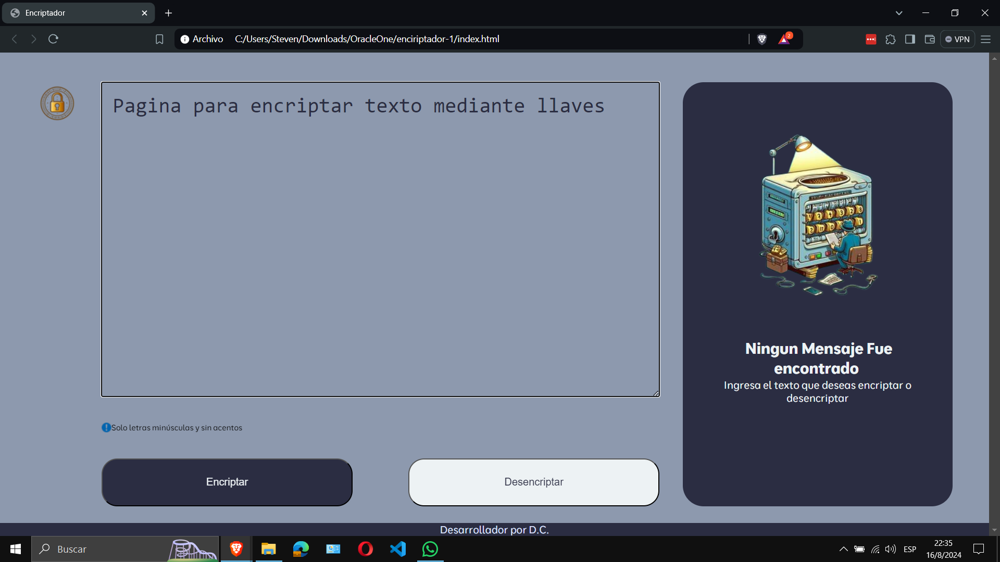

# Proyecto de Cifrado y Descifrado de Texto

Este proyecto es una aplicación web construida con **JavaScript**, **HTML**, y **CSS**. Permite a los usuarios ingresar un texto, elegir si desean cifrar o descifrar dicho texto, y ver el resultado en un cuadro resultante a la derecha de la ventana de navegación.

- **Ingresar Texto**: Los usuarios pueden escribir o pegar el texto que desean cifrar o descifrar.
- **Cifrar**: Al hacer clic en el botón "Cifrar", el texto ingresado se transforma usando un algoritmo de cifrado.
- **Descifrar**: Al hacer clic en el botón "Descifrar", el texto cifrado se devuelve a su estado original.
- **Mostrar Resultado**: El resultado del cifrado o descifrado se muestra en un cuadro a la derecha de la página.
- **Copiar al Portapapeles**: Un botón adicional permite copiar el contenido del cuadro de resultado al portapapeles para su uso posterior.

## Algoritmo de Cifrado
Las "llaves" de encriptación que utilizaremos son las siguientes:

- La letra "e" es convertida para "enter"
- La letra "i" es convertida para "imes"
- La letra "a" es convertida para "ai"
- La letra "o" es convertida para "ober"
- La letra "u" es convertida para "ufat"

## Tecnologías Utilizadas

- **HTML**: Para estructurar la página y los elementos de entrada.
- **CSS**: Para dar estilo a la página y posicionar los elementos de manera adecuada y responsiva.
- **JavaScript**: Para manejar la lógica de cifrado y descifrado, parte del diseño y la interacción con el usuario.

## Cómo Usar

1. Ingrese el texto en el área de entrada.
2. Seleccione si desea **Encriptar** o **Desencriptar** el texto utilizando los botones correspondientes.
3. El resultado aparecerá en el cuadro a la derecha.
4. Si lo desea, puede copiar el resultado al portapapeles haciendo clic en el botón "Copiar".
5. El texto ingresado debe ser en minúsculas y no debe contener caracteres especiales, ni letras con acentos.

## Vista Previa

A continuación, se muestra una captura de pantalla de la aplicación funcionando:

- Ingreso Texto

- Encriptación

- Copia Texto Resultante

- Desencriptado

